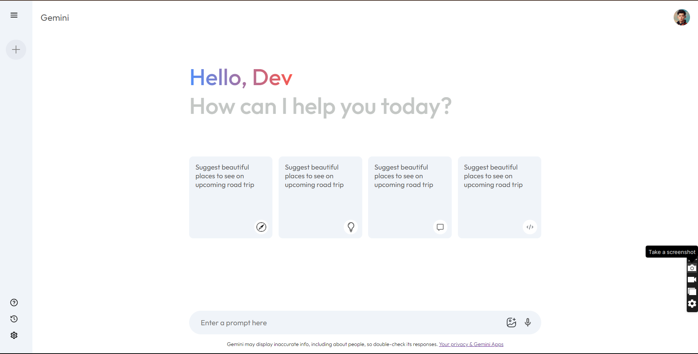

# Google Gemini Clone 

Google Gemini Clone is a React.js web application that replicates the search interface of Google Gemini. This project includes API integration with Google Gemini's language model, allowing users to experience a similar search experience. With this clone, users can explore the functionalities and design of Google Gemini within a React.js environment.

  

# How to use

1.  Clone the repo <code>git clone https://github.com/bhavyasingh9822/Gemini-Clone.git </code>
2.  Install required dependencies <code>npm i</code>
3. Run the server <code>npm run dev</code>
